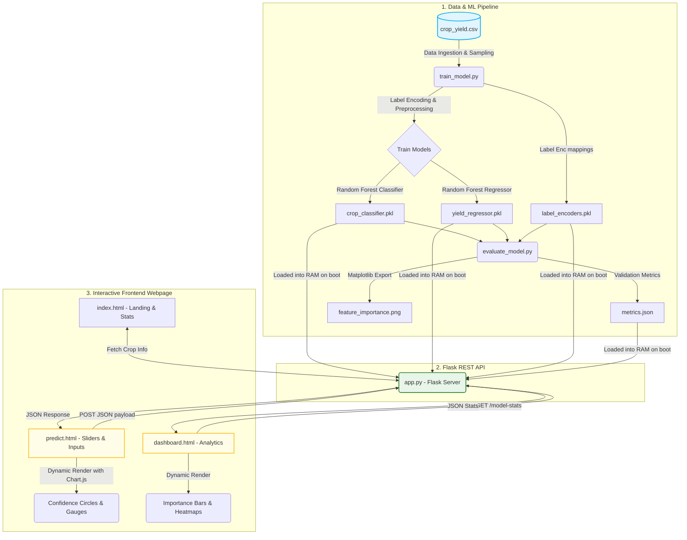

# Crop Yield Prediction & Recommendation System: Project Overview

This document provides a comprehensive overview of the technologies used, the workflow, and the file structure of the **Crop Yield Prediction & Recommendation System**.

---

## 🛠️ Technology Stack

The project is structured as a full-stack, machine learning-driven web application. It leverages a clean separation of concerns, divided into four primary layers:

### 1. Data Layer
*   **Format**: Structured Comma-Separated Values (CSV).
*   **Dataset**: `crop_yield.csv` (~1,000,000 rows, 10 columns) containing regional weather, soil types, crop types, agricultural practice flags (fertilizer/irrigation), and yield metrics.

### 2. Machine Learning Modeling (`/model`)
*   **Programming Language**: Python 3.9+
*   **Core Libraries**:
    *   `scikit-learn`: Used for building and evaluating Machine Learning models.
        *   `RandomForestClassifier`: For crop recommendation (classification problem).
        *   `RandomForestRegressor`: For crop yield prediction (regression problem).
        *   `LabelEncoder`: For transforming categorical columns (`Region`, `Soil_Type`, `Weather_Condition`) into numeric classes.
        *   `train_test_split`: For dividing data into training and validation sets (80/20 split).
    *   `pandas`: For robust data ingestion, manipulation, and cleaning.
    *   `numpy`: For fast array transformations and numerical computations.
    *   `joblib`: For serialized model saving (`.pkl` format) and loading.
    *   `matplotlib` & `seaborn`: For rendering static, high-quality feature importance bar plots.

### 3. Backend REST API (`/backend`)
*   **Framework**: `Flask` (Python)
*   **Key Dependencies**:
    *   `flask-cors`: Enables Cross-Origin Resource Sharing (CORS), allowing the browser-based frontend (running via local files or a different port) to securely communicate with the backend.
    *   `joblib`: For deserializing the trained `.pkl` models and encoders on application startup.
*   **Endpoints**:
    *   `POST /predict`: Accepts environmental and agricultural JSON input, preprocesses it, runs classification and regression inferences, and yields crop recommendations (with probabilities) and predicted yields.
    *   `GET /model-stats`: Exposes training accuracy, R² score, Root Mean Squared Error (RMSE), and feature importance metrics.
    *   `GET /crops`: Exposes static metadata descriptions for supported crops.

### 4. Frontend Client Dashboard (`/frontend`)
*   **Core**: Vanilla HTML5, CSS3, and JavaScript (ES6+).
*   **Styling**: Custom modern CSS incorporating:
    *   A premium green/lime dashboard design.
    *   Glassmorphism card styling.
    *   Responsive layouts (flexbox/grid).
    *   Micro-animations (e.g., custom SVG hero animations showing falling raindrops and sunbeams).
*   **Interactive Visualization**: `Chart.js` is integrated to render dynamic, high-fidelity UI components:
    *   Doughnut confidence circles for crop classification probabilities.
    *   Semi-circular gauges for yield predictions.
    *   Side-by-side model feature importance bar charts.
    *   Distribution charts and custom heatmaps.

---

## 🔄 Project Workflow

The following flowchart illustrates the end-to-end data lifecycle and runtime workflow of the system:

### Step-by-Step Execution Flow:

1.  **Data Generation**: The source dataset resides in `data/crop_yield.csv`.
2.  **Pipeline Training**:
    *   `model/train_model.py` reads, samples, and cleans the dataset.
    *   Categorical variables are encoded into integer codes, and the fit transformers are saved as `label_encoders.pkl`.
    *   Two models are fit on features (Region, Soil, Weather, Temperature, Rainfall, Days to Harvest, Fertilizer, Irrigation):
        *   **Classifier**: Classifies the best suited crop.
        *   **Regressor**: Predicts expected yield in tons/hectare.
    *   The binary artifacts (`crop_classifier.pkl` and `yield_regressor.pkl`) are saved to the `model/saved_model/` directory.
3.  **Model Evaluation**:
    *   `model/evaluate_model.py` splits the test set to evaluate accuracy and regression scores ($R^2$, $RMSE$).
    *   It outputs model scores into `metrics.json` and exports importance visualizations into `feature_importance.png`.
4.  **Backend Startup**:
    *   `backend/app.py` fires up a local Flask server (running by default on port `5000`).
    *   Upon initializing, it loads the serialized models (`.pkl` files) and encoders into memory so that client requests can be predicted in sub-millisecond response times.
5.  **User Prediction Flow**:
    *   A user visits the UI dashboard and opens the prediction page (`frontend/predict.html`).
    *   After inputting values (e.g., Rainfall slider, Region selection, Weather type), JavaScript sends a HTTP `POST` JSON request containing features to the backend at `/predict`.
    *   The backend encodes the input categories, runs the classifier and regressor, and sends back the result JSON.
    *   JavaScript updates the webpage DOM, rendering the recommended crop alongside confidence graphs and a predicted yield gauge using `Chart.js`.
6.  **Analytics Inspection**:
    *   When the user browses to the performance tab (`frontend/dashboard.html`), JavaScript requests `/model-stats`.
    *   The analytics page draws active performance indicators, including dynamic bar graphs, heatmaps, and distribution plots.

---

## 📁 Key File Locations and Roles

*   [README.md](file:///d:/Project/Crop/README.md): Primary system setup, installation guides, command references, and REST API specification.
*   [PROJECT_OVERVIEW.md](file:///d:/Project/Crop/PROJECT_OVERVIEW.md): This file (overall technology stack and pipeline workflow details).
*   [backend/app.py](file:///d:/Project/Crop/backend/app.py): The main execution script running the Flask application server.
*   [backend/utils.py](file:///d:/Project/Crop/backend/utils.py): Utility scripts mapping static crop details and computing categorical labels.
*   [model/train_model.py](file:///d:/Project/Crop/model/train_model.py): Model training routine.
*   [model/evaluate_model.py](file:///d:/Project/Crop/model/evaluate_model.py): Model evaluation and graph visualization routine.
*   [frontend/index.html](file:///d:/Project/Crop/frontend/index.html): Client landing page.
*   [frontend/predict.html](file:///d:/Project/Crop/frontend/predict.html): Interactive form predictor.
*   [frontend/dashboard.html](file:///d:/Project/Crop/frontend/dashboard.html): Statistical model dashboard.
*   [notebooks/eda.ipynb](file:///d:/Project/Crop/notebooks/eda.ipynb): Data discovery and experimental Jupyter Notebook.
